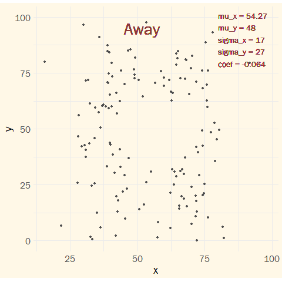

This weeks [#tidytuesday](https://twitter.com/hashtag/tidytuesday?src=hashtag_click) is all about deception of statistics. The `datasauRus` package contains 13 different datasets where the summary stats are practically same, however when plotted they look wildly different.
```{r set-up}
setwd("~/GitHub/tidytuesday")
library(tidyverse)
library(datasauRus)
library(gganimate)
library(ggtext)

loadfonts(device = "win")
```

```{r data}
# lets take a peek at the data
head(datasaurus_dozen)
```
```{r data processing}
# data processing

#-calculating summary stats
stats= datasaurus_dozen %>%
  group_by(dataset) %>%
  summarise(mean_x = mean(x, na.rm = T),
            mean_y = mean(y, na.rm = T),
            sd_x   =   sd(x, na.rm = T),
            sd_y   =   sd(y, na.rm = T),
            coeff  = cor(y, x))

#-creating an animated plot transitioning through all the datasets
plot_datasets = datasaurus_dozen %>%
  # join stats to data points
  left_join(stats) %>%
  mutate(dataset = str_replace_all(dataset, "_", " "),
         dataset = str_to_title(dataset)) %>%
  # plot
  ggplot(aes(x = x, y = y)) + 
  geom_point(color="grey31") +
  # adding title & summary stats to the plot
  geom_text(x = 45, y = 95, hjust = 0, vjust = 0.5, size = 10, family = "Franklin Gothic Book",
            aes(label = dataset), color="indianred4")+
  geom_text(x = 80, y = 90, hjust = 0, vjust = 0.5, size = 5, family = "Franklin Gothic Book",
            aes(label = paste0("mu_x = ", round(mean_x,2), "\n",
                                "mu_y = ", round(mean_y), "\n",
                                "sigma_x = ", round(sd_x), "\n",
                                "sigma_y = ", round(sd_y), "\n",
                                "coef = ", round(coeff, 3))),
            color="indianred4") +
  #animate by dataset
  transition_states(dataset, wrap = T,
                    transition_length = 1,
                    state_length = 2) +
  # aesthetics
  theme_minimal() +
  theme(aspect.ratio = 1,
        text = element_text(family = "Franklin Gothic Book", size = 20),
        plot.background = element_rect(fill = "#FFF8E7", color = "transparent"))


```

```{r, include=FALSE}
#-saving gif
gif_datasets = animate(plot_datasets)
anim_save("plots/2020-10-13_datasets.gif")
```

