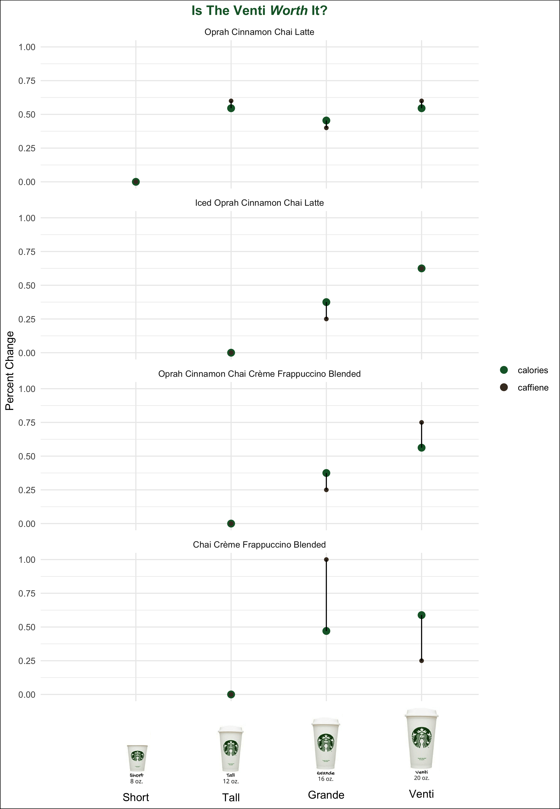

# Starbucks Drinks

With this [Starbucks dataset](https://github.com/rfordatascience/tidytuesday/tree/master/data/2021/2021-12-21), I was curious to see if the increased caffiene for the larger drink sizes could justify a venti over a short. 

## Data Cleaning 
The data was pretty clean with the exception of the duplicate entires for the Iced Caffè Mocha. There were duplicate entries with different nutritional value amounts (i.e. calories, sugars) with out any explainable difference in the dataset. I imagine that something like a chococlate drizzle could explain this variation but it was not captured in the dataset. I focued on Chai Lattes since I dont drink coffee.

I subsetted the data for Starbuck's Speciatly drinks. I ended up filtering the data for "short", "tall", and "venti" sizes, filtering for whole milk, and filtering for no whip cream. I then calculated the percent difference in calories and caffiene in sizes.

## Plot

## Thoughts 
I am not a frequent buyer of starbucks but I was suprised to see the Chai menu items as I had never seen them before. It would have been great to get a dataset where each component of a drink (i.e. shot of coffee, pump of chai, whip cream) had its own calorie and caffiene values so that I could recreate my Starbucks order and calculate whether my order is "worth it"